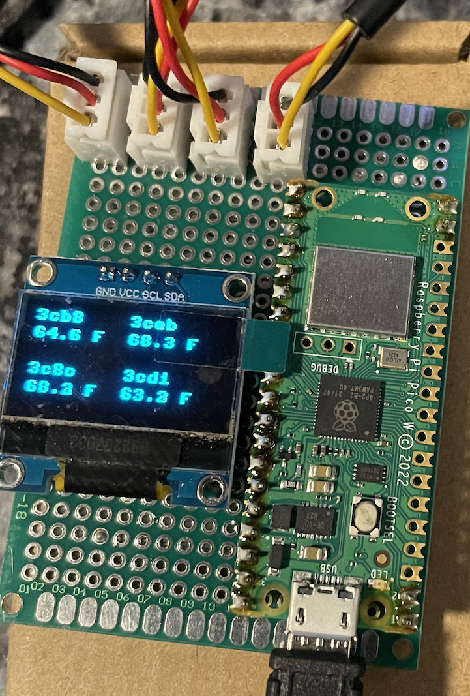
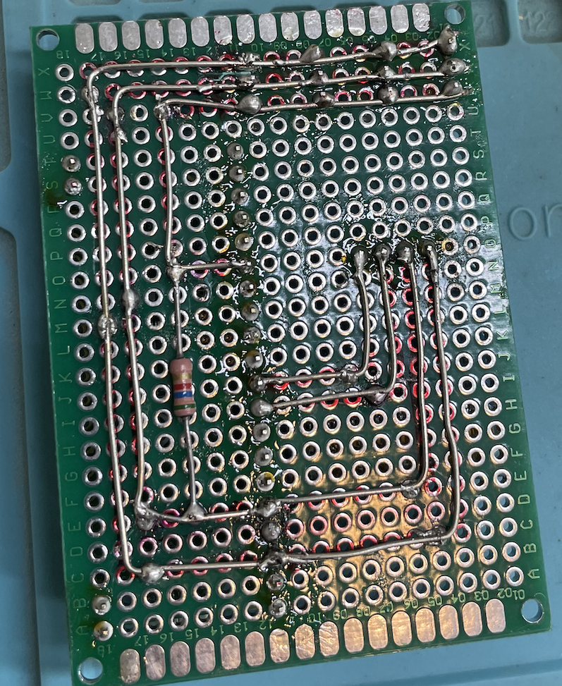

# Temp-Sensor
Micropython Code to control pico w for multiple temperature sensors and OLED display

I will update this with more details as time goes on.

Uses:  
Stainless Steel Probe DS18B20 
OLED Display Module, 128 x 64 0.96 inches OLED Display 12864 LCD Module for 51 Series MSP430 STM32 
Pico W

Instructions:

Uses Tools->Manage Packages->Micropython-umqtt.simple

<BR 
 
